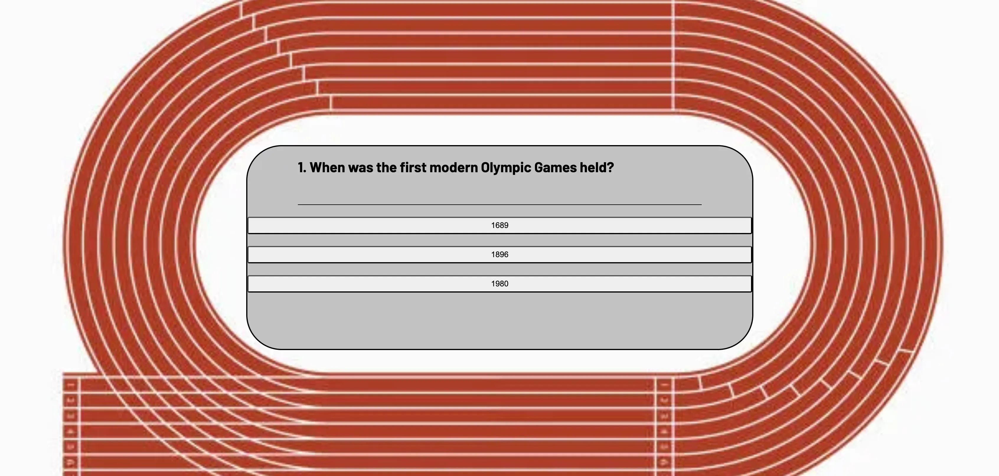
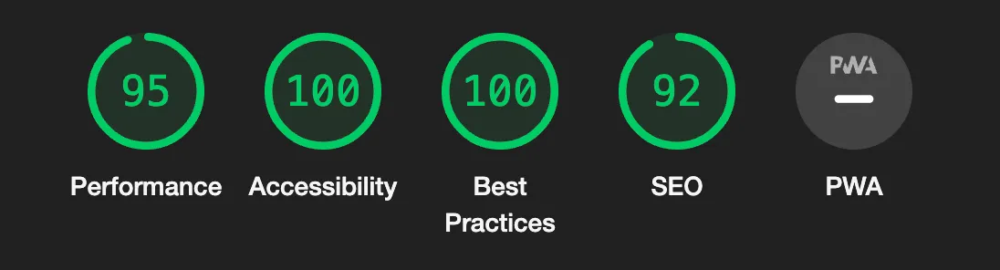

# Olympics Quiz

Olympics quiz is a site that aims to provide users with a fun and engaging quiz to test their knowledge of the Olympic Games.
The site provides 10 questions, each with 3 multiple choice answers displayed on individual buttons for the user to choose from, and upon selecting their answer, the user will be shown whether it was a correct or an incorrect answer turning the button green if they answered correctly, or red if they answered incorrectly, in which case the correct answer is also shown in green.
After completing the last question, the user will be shown their score out of 10, with an option to play again.

## Features

### Existing Features

- __Header__

    - The header for this site includes the site title placed in the centre of the page in black lettering, over a white background for easy readability.
    - On either side of the site title is the Olympic logo to make the header look visually appealing and add some colour, as well as to add to the overall theme of the site being the Olympic Games.

- __Background Image__

    - The page includes a background image of an athletics race track which is circled around the central quiz area, to grab users attention and draw them to the topic of the site straight away.
    - The color of the race track image is fairly bright in order to draw attention to the area enclosed in the middle, which is the user interactive part of the site.
    - This image draws the users attention to the page straight away.

- __Central quiz area__

    - The quiz area for the site is located in the centre of the page, inside the race track image.
    - The quiz area features a grey box which displays each quiz question one at a time, and underneath each question there are 3 separate white answer buttons to give the user a multiple choice selection to answer each question.
    - The colours of the quiz area are neutral to contrast with the brightness of the surrounding race track image.
    - When the user clicks on an answer from the multiple choice buttons, if they have selected the correct answer the button will turn green to indicate a correct answer, and if they have selected an incorrect answer the button will turn red, as well as turning the correct button green to show the correct answer to the user.
    - Once the user has selected an answer button, all three buttons become disabled and the user cannot select another answer, and a blue button appears below the answer buttons which reads 'Next Question!', when the user clicks this button the next question will display.

- __End of Quiz Display__

    - When the user has selected answers for all 10 questions, the quiz area will display the users score out of 10, and a new button will appear which reads 'Play Again!' offering users the chance to try and beat their previous score.

### Features Left to Implement

- One feature that would be implemented in future would be to randomise the order of the questions, so that when the user selects the 'Play Again!' button at the end of the quiz, the questions would appear in a different order.
- Another feature to implement would be to have a navbar at the top of the page with a link to another page of the website, which would have another quiz set at a harder difficulty level.

## Testing

- I tested that this page works in different browsers, Chrome and Safari.

- I confirmed that this project is responsive, looks good and functions on all standard screen sizes using the devtools device toolbar.

- I confirmed that the title, quiz questions and answers and next question buttons are all readable and easy to understand.

- I confirmed that the quiz functions correctly, with the buttons responding the the user clicking on them in the right way and the next question loading correctly each time.

### Validator Testing

- HTML
  - No errors were returned when passing through the official [W3C validator](https://validator.w3.org/nu/?doc=https%3A%2F%2Fcode-institute-org.github.io%2Flove-running-2.0%2Findex.html)
- CSS
  - No errors were found when passing through the official [(Jigsaw) validator](https://jigsaw.w3.org/css-validator/validator?uri=https%3A%2F%2Fvalidator.w3.org%2Fnu%2F%3Fdoc%3Dhttps%253A%252F%252Fcode-institute-org.github.io%252Flove-running-2.0%252Findex.html&profile=css3svg&usermedium=all&warning=1&vextwarning=&lang=en#css)
- JavaScript
  - No errors were found when passing through the official JavaScript validator https://jshint.com/
  - The following metrics were returned:
  - There are 9 functions in this file.
  - Function with the largest signature take 1 arguments, while the median is 0.
  - Largest function has 8 statements in it, while the median is 4.
  - The most complex function has a cyclomatic complexity value of 2 while the median is 2.
- Accessibility
  - I confirmed that the colours and fonts chosen are easy to read and accessible by running it through lighthouse in devtools.

### Unfixed Bugs

The only unfixed bug is I was unable to perfect the responsiveness of the quiz area for all device screen sizes.

## Deployment

- The site was deployed to GitHub pages. The steps to deploy are as follows: 
  - In the GitHub repository, navigate to the Settings tab 
  - From the source section drop-down menu, select the Main Branch
  - Once the main branch has been selected, the page will be automatically refresh with a detailed ribbon display to indicate the successful deployment. 

The live link can be found here - https://jaysinna.github.io/olympics-quiz/

## Credits 

### Content 

- The content for the quiz questions and answers was taken from Google searches.
- Instructions on how to implement quiz questions array and create game functions were taken from various YouTube tutorials and Google searches.

### Media

- The images for the olympics logos in the header and the background race track image around the quiz area were taken from google images.